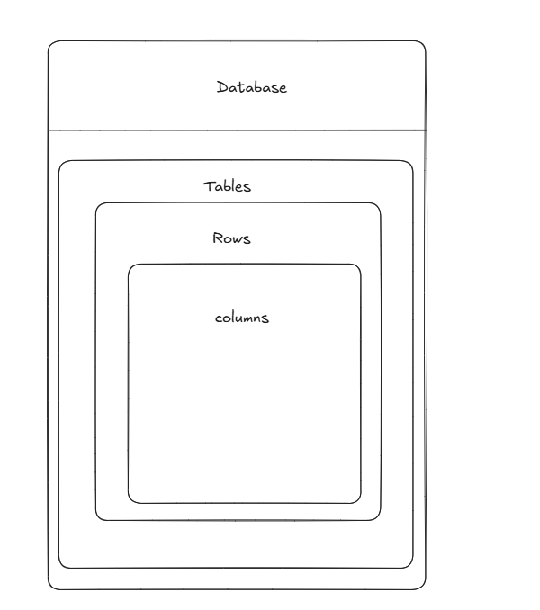

จดโน้ตเกี่ยวกับที่ตัวเองเข้าใจ PostgreSQL คือ ระบบฐานข้อมูล (Database Mangment System) แบบ Relational Database ที่ใช้ภาษา SQL ในการจัดการข้อมูล
สรุปคือ PostgreSQL = โปรแกรมเก็บข้อมูล + ใช้ SQL คุยกับมัน 
PostgreSQL จะมีโครงสร้างที่ประกอบด้วย
    1.Database คือ ฐานข้อมูลหลัก เปรียบเหมือน folder ใหญ่ที่เก็บข้อมูลทั้งหมดไว้ เป็นพื้นที่เก็บข้อมูลหลักที่ภายในจะประกอบด้วยหลาย table 
            เช่น ecommerce_db
                school_db
                netflix-db
    2.Table ภายใน Database จะมีตาราง (Table)สำหรับเก็บข้อมูล เปรียบเหมือน Entity ในเชิงของข้อมูลที่เป็นสิ่งที่ต้องการเก็บข้อมูล
            เช่น customer
                products
                orders
    3.Row คือ แถวของข้อมูลจริง
            เช่น id   name   price
                1    iphone 35000
                2    mouse  500
            โดยแต่ละแถวคือ 1 row จากตัวอย่างคือ
                id=1 , name=iphone , price=35000
                สรุปคือ row คือ ข้อมูล 1 รายการ
    4.Column คือ ชนิดของข้อมูล หรือหัวข้อของข้อมูล
              เช่น id   name   price
                1    iphone 35000
                2    mouse  500
            Column มี 3 อัน คือ
                id
                name
                price
            แต่ละ columns จะบอกว่าข้อมูลในแถวนั้นคืออะไร